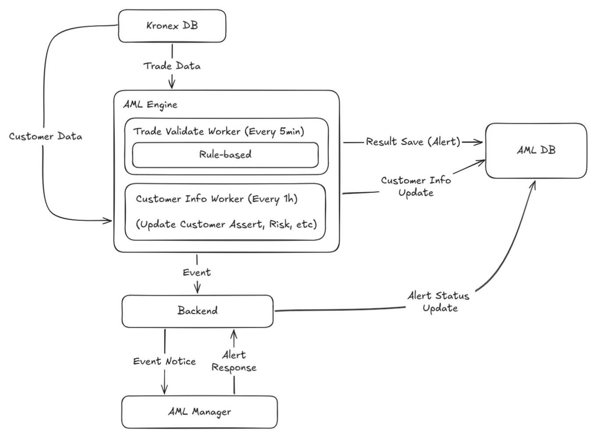

# AML PoC

이 레포지스토리는 거래소의 이상거래를 탐지하는 AML 시스템입니다.

AML을 이해하고 학습하기 위한 PoC 목적으로 제작되었으며, 실제로 안정적으로 작동하기 위한 예외처리가 되어있지 않습니다.

Kronex 가상 거래소 시스템을 기반으로 작동합니다.

<a href="https://github.com/orgs/KRONEX-Stock-Exchange/repositories">Kronex Repository↗</a>

## Content

- [System Architecture](#system-architecture)
- [Backend](./backend/README.md)
- [Frontend](./frontend/README.md)

## System Architecture

