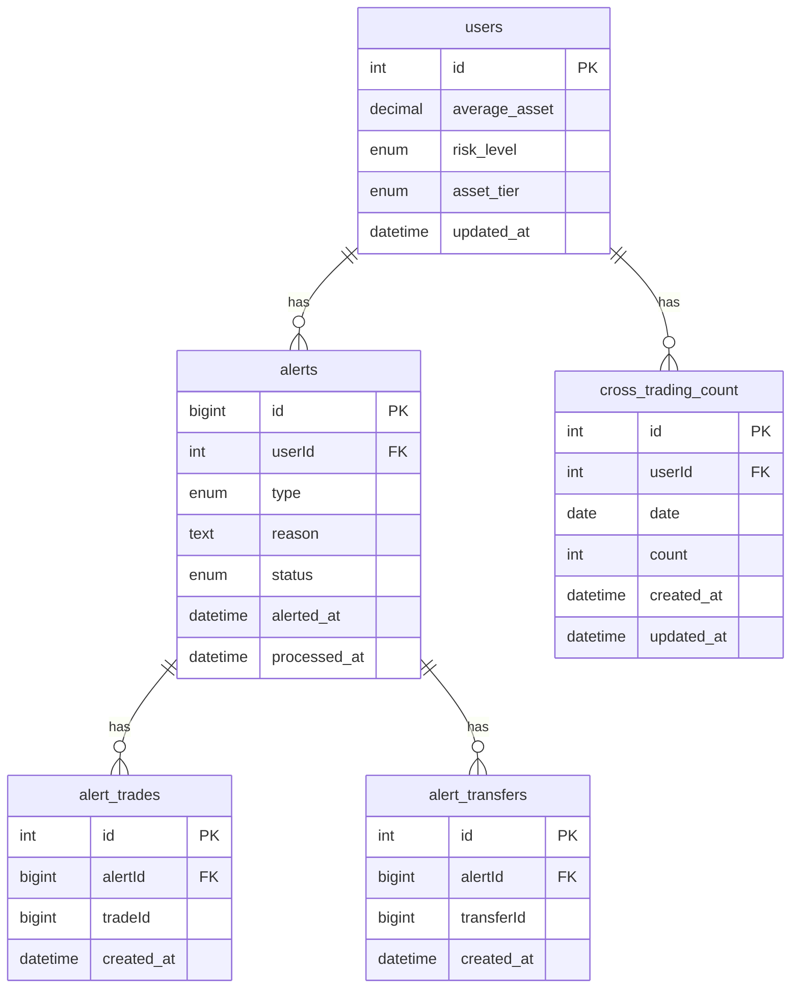
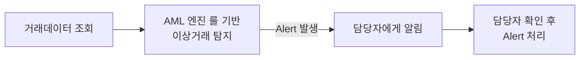

# AML Backend

거래소의 이상거래를 탐지하는 AML 엔진 및 API 서버입니다.

## Content

- [ERD](#erd)
- [System WorkerFlow](#system-workerflow)
- [Implement](#implement)
  - [Asset Tier](#asset-tier)
  - [User Risk](#user-risk)
  - [Rule-based Detection](#rule-based-detection)
  - [AML Manager Processing](#aml-manager-processing)
- [How to Run](#how-to-run)

## ERD



## System WorkerFlow



## Implement

### Asset Tier

유저의 평균 자산 규모를 기준으로 나눈 등급입니다.
1시간 간격으로 갱신됩니다.

|   등급   | 평균 자산 기준    | 단일 거래 임계값 (k=0.5) | 1시간 누적 임계값 |
| :------: | ----------------- | ------------------------ | ----------------- |
|  `LOW`   | ~2,000만원        | 1,000만원 이상           | 2,000만원 이상    |
| `MEDIUM` | 2,000만원 ~ 2억원 | 5,000만원 이상           | 1억원 이상        |
|  `HIGH`  | 2억원 이상        | 1억원 이상               | 2억원 이상        |

```
단일 거래 임계값 = 등급 평균자산 * k
1시간 누적 임계값 = 단일 거래 임계값 * 2

(K 값은 임의로 조정가능)
```

### User Risk

최근 한달 동안 누적된 유효한 Alert 발생 횟수를 기준으로 나눠집니다. 매달 1일 마다 갱신됩니다.

> 유요한 Alert는 AML 담당자가 이상 거래로 판단한 Alert를 의미합니다.

|   등급   | 지난 달 1일 부터 발생한 Alert 횟수 |
| :------: | ---------------------------------- |
|  `LOW`   | 0 ~ 2회                            |
| `MEDIUM` | 3 ~ 5회                            |
|  `HIGH`  | 6회 이상                           |

> User Risk 갱신시 등급이 하락하는 경우 한 단계씩 하락합니다.

### Rule-based Detection

엔진에는 총 **3가지 시나리오**와 이에 기반한 Rule을 바탕으로 이상거래를 탐지 후 Alert 처리합니다.

#### 1. 단일 거래시 일정 금액 이상의 거래

사용자의 Asset Tier에 비해 일정 금액 이상의 단일 거래시 Alert를 발생시킵니다.

```
단일 거래금액 >= (해당 등급의 평균 자산 * k)
```

```
ex) k = 0.5
  - 평균자산 2000만원 등급 유저가
  - 단일 거래로 1000만원 이상 거래시 Alert
```

#### 2. 자전거래

같은 유저 명의의 계좌끼리 거래가 발생시 이를 카운트합니다. **UTC 기준 자정(00:00)에 카운트가 초기화**되며, 초기화 전까지 자전거래 횟수가 **100회**를 초과하면 Alert를 발생시킵니다.

#### 3. 비정상적인 입출금

- **단일 송금**: 받은 송금액이 Asset Tier에 따른 단일 거래 임계값 이상일시 Alert를 발생시킵니다.

- **누적 송금**: 한 시간 이내의 시간에 받은 송금액이 Asset Tier에 따른 단일 거래 임계값 이상일시 Alert를 발생시킵니다.

### AML Manager Processing

Alert가 발생하면 담당자 대시보드에 알림이 전송되고 담당자가 Alert 사유, 관련 거래내역, 유저 정보를 확인 후 Alert를 처리합니다.

(구현시 이미지로 대체 예정)

## How to Run

### Requirements

| 항목            | 버전 / 값                                                                                                                         |
| --------------- | --------------------------------------------------------------------------------------------------------------------------------- |
| Go              | `1.26.1`                                                                                                                          |
| Source Database | <a href="https://github.com/KRONEX-Stock-Exchange/kronex-server/blob/dev/prisma/schema.prisma">Kronex Server Database (0.6.5)</a> |
| Database        | MySQL 8.0 (Source Database와 동일한 버전 사용)                                                                                    |

AML Database와 Source Database는 같은 인스턴스 Database를 사용합니다.

### Environment Variables

`.env.example`를 참고하여 `.env` 파일을 생성하세요.

```
APP_PORT=8080

DB_HOST=127.0.0.1
DB_PORT=3306
DB_USER=root
DB_PASSWORD=password
DB_NAME=aml
```

### Run

```bash
go run main.go
```
