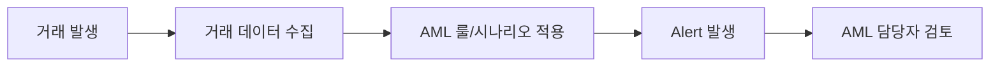
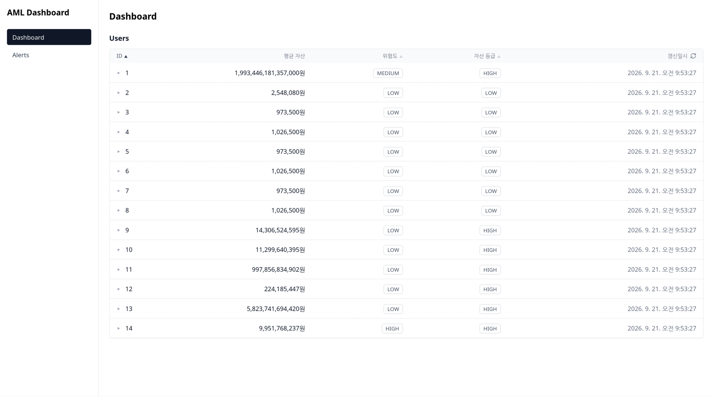
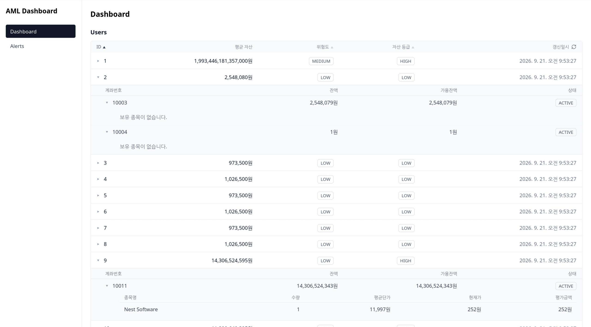
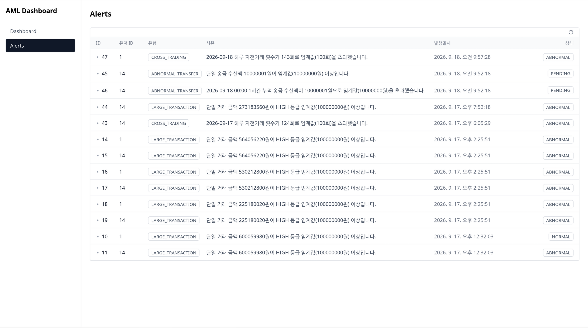
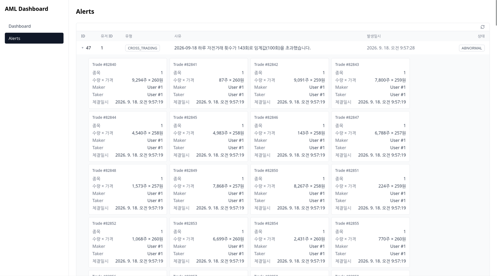

# Overview

이 문서는 비개발자를 대상으로 작성한 문서입니다. 기술적인 구현 내용은 [백엔드](../backend/README.md), [프론트엔드](../frontend/README.md) 문서를 참고하세요.

## 목차

- [구현 배경](#구현-배경)
- [등급 체계](#등급-체계)
  - [Asset Tier](#asset-tier)
  - [User Risk](#user-risk)
- [탐지 룰](#탐지-룰)
- [구현 화면](#구현-화면)

## 구현 배경

이 레포지스토리는 AML(자금세탁방지)을 이해하고 학습하기 위한 PoC로 제작되었습니다.

개발에는 기존에 진행했던 가상 거래소 프로젝트인 <a href="https://github.com/orgs/KRONEX-Stock-Exchange/repositories">Kronex</a>를 사용했습니다. Kronex를 운영하며 실제로 발생했던 비정상 거래를 탐지하고, 여기에 실제 AML 시스템의 구조를 일부 적용하여 구현하게되었습니다.

Kronex를 운영하며 비정상 거래와 관련해 다음과 같은 문제가 있었습니다.

1. 자전거래로 인한 주가 조작 및 자산 증식
2. 시스템을 이용한 부정 자산 증식
   - 신규 유저 가입 시 첫 계좌에 100만원이 자동으로 입금되는 정책을 악용해, 계정을 반복해서 만들어 초기 지원금을 받은 뒤 특정 계좌로 몰아 보내는 방식으로 자산을 불리는 사례

이 PoC는 아래와 같은 AML의 구조를 가져와 적용하였습니다.

- Kronex 거래 데이터 수집
- 고객별 등급 부여
- 거래 탐지 룰 기반 Alert를 발생
- 담당자가 Alert 사유와 관련 거래를 확인할 수 있는 화면 구현

## 등급 체계

Rule-based 탐지 룰을 구현하기 전, AML 시스템이 더 정확히 탐지하고 담당자가 Alert를 판단하는 데 참고할 수 있도록 두 가지 등급 체계를 먼저 설계했습니다.

### Asset Tier

유저가 가진 전체 자산 규모를 기준으로 나눈 등급입니다. 탐지 룰이 유저의 자산 규모에 맞는 기준을 참고하여 더 정확히 탐지하도록 하기 위해 만들었습니다.

### User Risk

담당자가 실제로 "이상 거래가 맞다"고 처리한 Alert 횟수를 기준으로 나눈 위험도입니다. 담당자가 후속 조치와 판단에 참고할 수 있도록 추가했습니다.

<small>정확한 등급 기준은 [백엔드 문서 - Asset Tier](../backend/README.md#asset-tier), [User Risk](../backend/README.md#user-risk)에서 확인할 수 있습니다.</small>

## 탐지 룰

**자전거래**

- 왜 필요한가: 같은 사람이 자기 계좌끼리 거래를 반복하며 주가를 조작하고 자산을 불리는 문제가 있었습니다.
- 어떤 데이터: 같은 유저 명의의 계좌 사이에 체결된 거래
- 어떤 조건: 하루 동안 발생한 자전거래 횟수가 기준치를 넘으면 탐지
- 결과 확인: 담당자 화면에서 해당 거래들을 모아 볼 수 있습니다.

**입출금시 단일 송금 금액**

- 왜 필요한가: 앞선 문제와 별개로 일정 금액 이상의 거래는 그 자체로 확인이 필요하다고 생각하여 추가하였습니다.
- 어떤 데이터: 체결된 거래 금액
- 어떤 조건: 한 번의 거래 금액이 룰 기준치를 넘으면 탐지
- 결과 확인: 담당자 화면에서 해당 거래 내역을 확인할 수 있습니다.

**비정상 입출금**

- 왜 필요한가: 신규 가입 지원금을 여러 계정으로 반복 수령해 한 계좌로 몰아 보내는 방식의 자산 증식 문제가 있었습니다.
- 어떤 데이터: 계좌가 받은 송금 내역
- 어떤 조건: 한 번에 받은 금액, 또는 정해진 시간 동안 누적으로 받은 금액이 기준치를 넘으면 탐지
- 결과 확인: 담당자 화면에서 어떤 송금이 기준을 넘었는지 확인할 수 있습니다.

<small>정확한 계산식과 기준값은 [백엔드 문서 - Rule-based Detection](../backend/README.md#rule-based-detection)에서 확인할 수 있습니다.</small>

## 구현 화면

탐지 룰이 Alert를 발생시키면, 담당자는 대시보드 화면에서 이를 확인하고 처리합니다.

### Dashboard

전체 유저의 자산, 위험도, 등급을 한눈에 볼 수 있습니다. 유저를 클릭하면 그 유저가 가진 계좌와 보유 종목까지 순서대로 펼쳐서 볼 수 있습니다.

### Alerts

발생한 Alert 목록을 보여줍니다. Alert를 클릭하면 왜 이 Alert가 발생했는지 근거가 된 거래·송금 내역이 함께 펼쳐지고, 담당자는 이를 보고 실제 이상 거래인지 아닌지 판단해 상태를 변경 할 수 있습니다.

